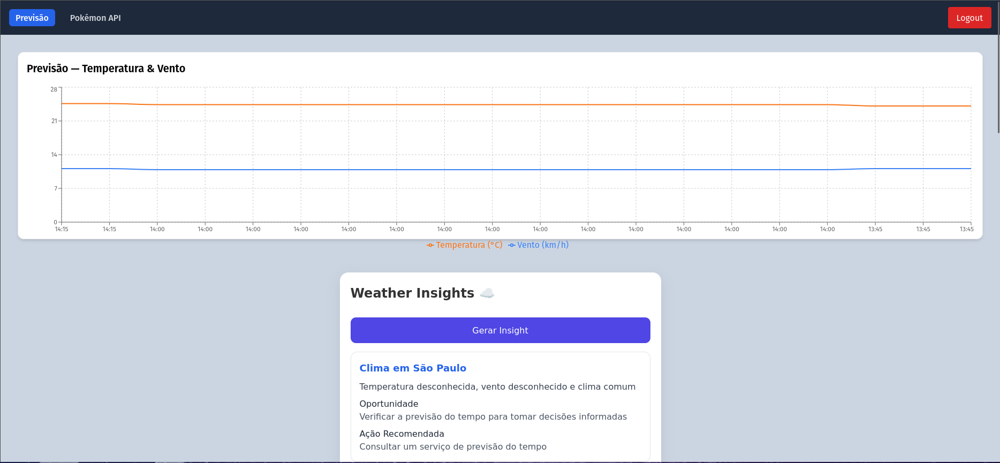
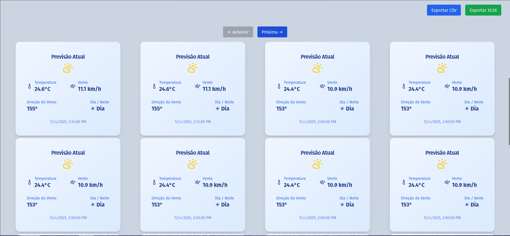
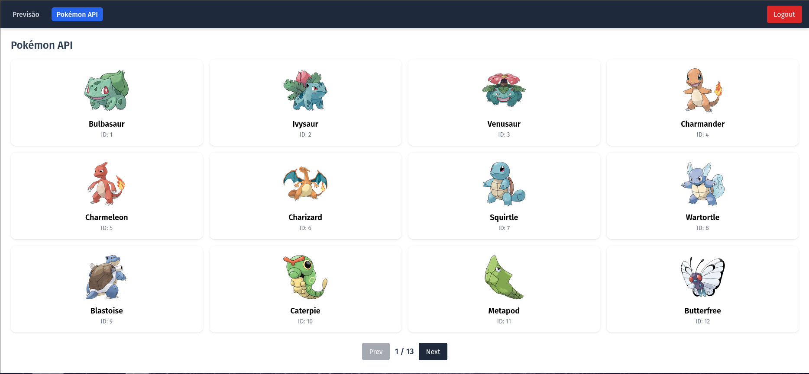

## GDASH Challenge — Weather Intelligence System

Full-Stack Pipeline: Python → Message Broker → Go → NestJS → MongoDB → React

------------------



------------------

### Demonstração do Projeto

Assista ao vídeo demonstrativo completo sobre o **Weather Monitoring System** para entender a coleta e processamento de dados climáticos.

[▶️ Vídeo: Weather Monitoring System — Coleta, Processamento e Armazenamento de Dados Climáticos](https://www.youtube.com/watch?v=sBl19casoSs)

## Status da Implementação Atual


| Módulo                                             | Status                   | Descrição                                                       |
| -------------------------------------------------- | ------------------------ | --------------------------------------------------------------- |
| **Frontend (React + Vite + Tailwind + shadcn/ui)** | ✅ Em funcionamento       | Dashboard inicial, login, rotas protegidas, exportação CSV/XLSX |
| **Autenticação JWT (frontend e backend)**          | ✅ Implementado           | Login, register, armazenamento de token e proteção de rotas     |
| **Backend NestJS (API + MongoDB)**                 | ✅ Em funcionamento       | CRUD de clima, exportação de dados, login/register              |
| **Exportação CSV/XLSX**                            | ✅ Implementado           | Front integrado aos endpoints                                   |
| **Dashboard de Clima (frontend)**                  | ✅ Em funcionamento         | Exibição de métricas básicas + botões de export                 |
| **Pipeline Python → Fila → Go → NestJS**           | ✅ Em funcionamento | (A ser desenvolvido)                                            |
| **Insights de IA (Groq)**                          | ✅ implementado    | Rota criada e integração funcionando |
| **Página pública — PokéAPI com paginação**         | ✅ Implementada             | Página com listagem, paginação e integração externa |
| **Navbar com rota ativa**                           | ✅ Implementado             | Indica visualmente a página atual |
| **Componente de Paginação reutilizável**            | ✅ Implementado             | Usado no módulo Pokémon e pronto para o Weather |
| **Docker Compose para todos os serviços**          | ✅ Em funcionamento  | já desenvolvido                                              |

## O que já foi entregue (completo)

### Backend — NestJS + MongoDB

### APIs implementadas até agora:

* Modelo salvo corretamente com:
  * temperatura
  * velocidade do vento
  * raw data
  * timestamp automático

### Configurações implementadas
* Integração com MongoDB
* Middlewares de autenticação
* Guards para proteger rotas privadas

### Serviço Python — Coletor Climático
* Coleta periódica via Open-Meteo/OpenWeather
* Normalização dos dados
* Envio para RabbitMQ
* Logs estruturados

### Fila + Worker Go
* Consumo de mensagens
* Transformação dos dados
* Envio para NestJS
* Retry com backoff
* Logging + DLQ

### Frontend — React + Vite + Tailwind + shadcn/ui

### Autenticação
* Tela de login
* Tela de registro
* Token salvo no localStorage
* Axios/fetch com Bearer Token
* Rotas privadas usando wrappers

### Dashboard inicial
* Botões de exportação CSV e XLSX funcionando
* Requisições autenticadas ao backend
* Exibição básica dos dados vindos da API

### Estrutura ok
* React Router configurado
* API Base extraída via .env (VITE_API_BASE)
* Layout inicial pronto

## Tabela de Rotas da Aplicação

| Rota / Endpoint             | Método | Serviço   | Autenticação | Descrição |
|-----------------------------|--------|-----------|--------------|-----------|
| /auth/register              | POST   | Backend   | ❌ Não        | Cria um novo usuário. |
| /auth/login                 | POST   | Backend   | ❌ Não        | Autentica e retorna JWT. |
| /weather                    | GET    | Backend   | ✅ Sim       | Lista todos os registros de clima. |
| /weather/export/csv         | GET    | Backend   | ✅ Sim       | Exporta os dados em CSV. |
| /weather/export/xlsx        | GET    | Backend   | ✅ Sim       | Exporta os dados em XLSX. |
| /weather/logs               | POST   | Backend   | 🔒 Interna   | Usada pelo worker Go para salvar logs. |
  /insights                    | POST    | Backend   | ✅ Sim       | Gerar insights com base em dados de previsão |
| /login                      | GET    | Frontend  | ❌ Não        | Tela de login. |
| /register                   | GET    | Frontend  | ❌ Não        | Tela de registro. |
| /                          | GET    | Frontend  | ✅ Sim       | Dashboard com dados de clima. |
| /users (futuro)             | GET    | Frontend  | ✅ Sim       | Listagem de usuários. |
| (Python collector)          | -      | Python    | N/A          | Coleta clima e envia para a fila. |
| (Go worker)                 | -      | Go        | N/A          | Processa fila e envia para NestJS. |

## Integração com API Pública — PokéAPI

Foi adicionada uma nova área experimental no frontend, permitindo testar paginação e consumo de APIs externas.

Funcionalidades incluídas:

* Página /pokemon listando pokémons da API pública
* Botões de navegação (Próximo / Anterior)
* Componente de paginação reutilizável
* Rotas ajustadas no React Router
* Navbar com destaque visual da rota ativa

Endpoints usados (frontend):
Endpoint	Descrição
```bash
GET https://pokeapi.co/api/v2/pokemon?limit=20&offset=X	Busca pokémons paginados
```


## Estrutura do Projeto (até o momento)

```bash

/frontend
  /src
    /api
      weatherApi.ts
      fetchClient.ts
      pokemonApi.ts
      authApi.ts
    /components
      WeatherExportButtons.tsx
      ProtectedRoute.tsx
    /pages
      Login.tsx
      Register.tsx
      Pokemon.tsx
      Home.tsx
    Dockerfile
    main.tsx
    App.tsx
    .env

/api
  /src
    /auth
    /weather
    /users
    /Groq
    /insights
  Dockerfile
  app.module.ts
  main.ts
  .env

/producer-python
  Dockerfile
  requirements.txt
  main.ts
  .env

/worker-go
  Dockerfile
  main.go
  .env

docker-compose.yml

```
## Como Rodar o Projeto

### Rodando com Docker
* Pré-requisitos
* Docker instalado → https://www.docker.com/

### Como Rodar o Projeto (Frontend + Backend)

```bash
docker-compose up -d --build
```

## Rotas

* Api
http://localhost:3000/api/

* Frontend
http://localhost:5173/